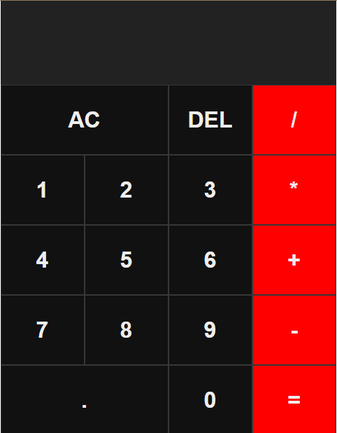
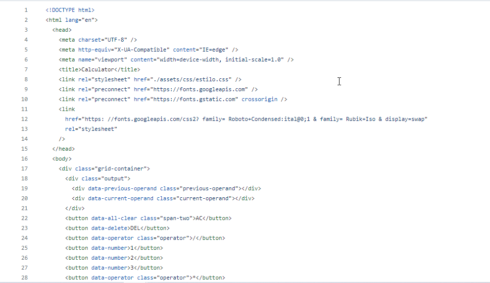
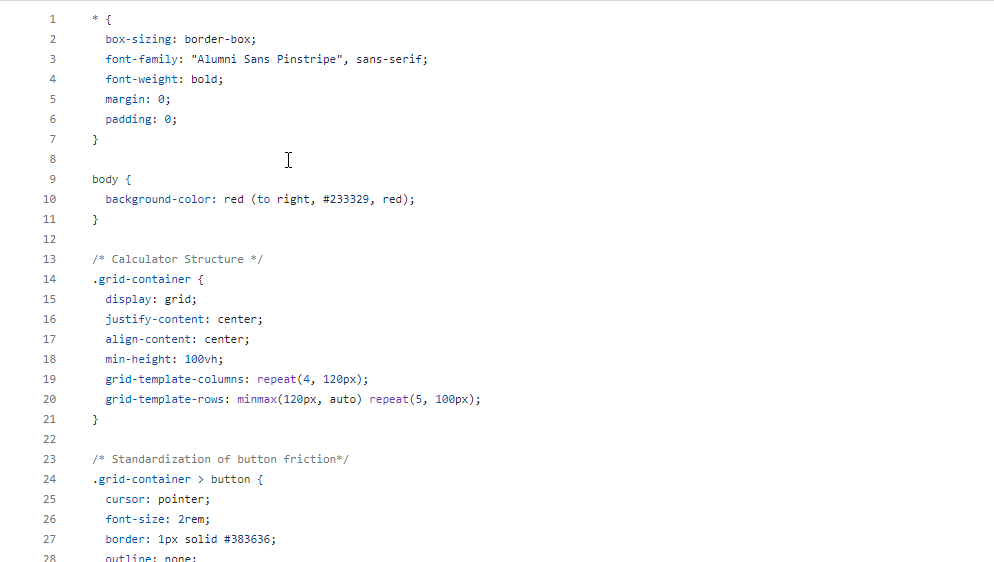
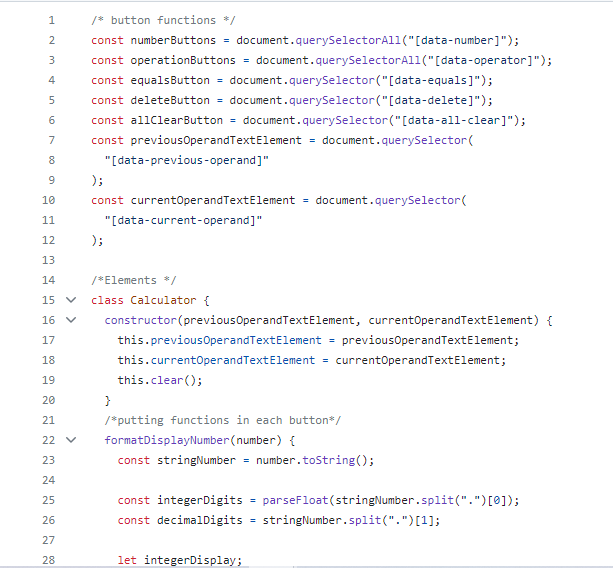

# Project_Calculator_V1

Simple Calculator Project, using HTML, CSS, and JavaScript

# Readme Contents:

- [Summary](#summary)
  - [About the project](#about)
  - [screenshot](#screenshot)
- [My code](#codes)
  - [HTML](#html)
  - [CSS](#css)
  - [Javascript](#js)
- [Process](#process)
  - [Designed](#designed)
- [Autor](#autor)
  - [link](#link)
 
## summary

### about

First front-end project, the purpose of this project was to create a simple calculator using a design model. The project is simple but functional. In the future, I plan to create a v2 of this project with better details and a more detailed plan

### screenshot

## codes

### html

Code HTML

 

### css

Code CSS

 

### js

Code Js

## process

### designed

- Model created on paper;;
- Semantic HTML;
- JJavaScript;
- First code;

## autor

### link

**link to acess the project**
https://patrickcaramico.github.io/Project_Calculator/
